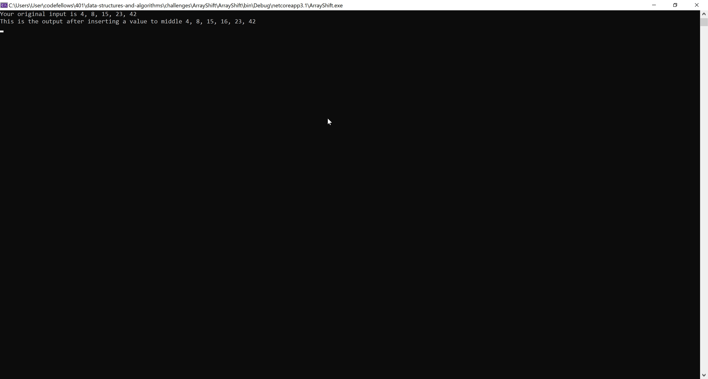

# **Array Shift**

**Author: Jin Kim**

---

### Problem Domain

Given an array insert the input integer value to the given array in the middle of the index.

---

### Inputs and Expected Outputs

| Input | Expected Output |
| :----------- | :----------- |
| [2,4,6,8], 5 | [2,4,5,6,8] |
| [4,8,15,23,42], 16 | [4,8,15,16,23,42] |

---

### Big O

| Time | Space |
| :----------- | :----------- |
| O(n) | O(n) |

---

### Whiteboard Visual

---
### Screen Shot
---

Screenshot of functional application

Screenshot of unit testing passed

---
### Change Log
1.3 - Added stretch goal method that will delete middle index element from given and return that array 
1.2 - Created Unit Testing that passes
1.1 - Added method that insert given value in to an array and shifting its length and position from the middle.
1.0 - Set up Repo and sort out 301 code challenges to 301 folders and started code challenge 2

