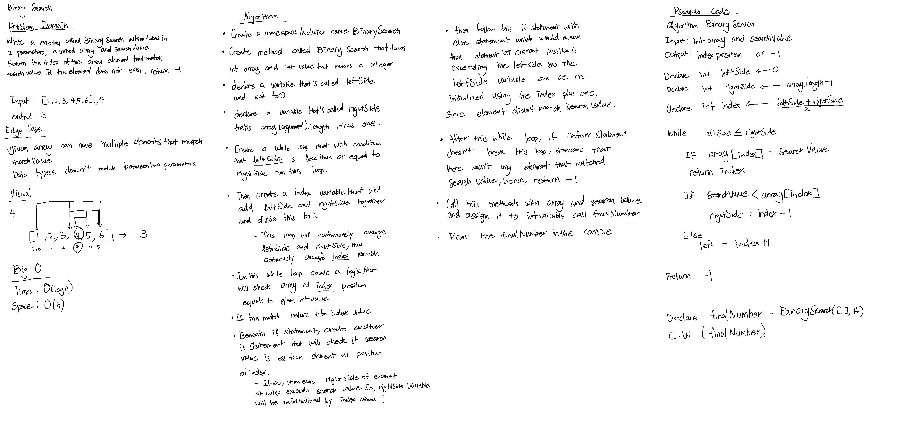

# **Binary Search**

**Author: Jin Kim**

---

### Problem Domain

Write a method called `BinarySearch` which takes in 2 parameters, a sorted array and 
search value. Return the index of the array element that match search value. If the element
does not exist, return -1.

---

### Inputs and Expected Outputs

| Input | Expected Output |
| :----------- | :----------- |
| [4,8,15,16,23,42], 15 | 2 |
| [11,22,33,44,55,66,77], 90 | -1 |

---

### Big O

| Time | Space |
| :----------- | :----------- |
| O(log n) | O(2n) |

---

### Whiteboard Visual

---

### Screen Shot
---

Screenshot of functional application

Screenshot of unit testing passed

---
### Change Log
- 1.3 - Finished README file for the program
- 1.2 - Changed the method to binary method.
- 1.1 - Created linear method that returns correct values.
- 1.0 - Set up folders in challenges folder

