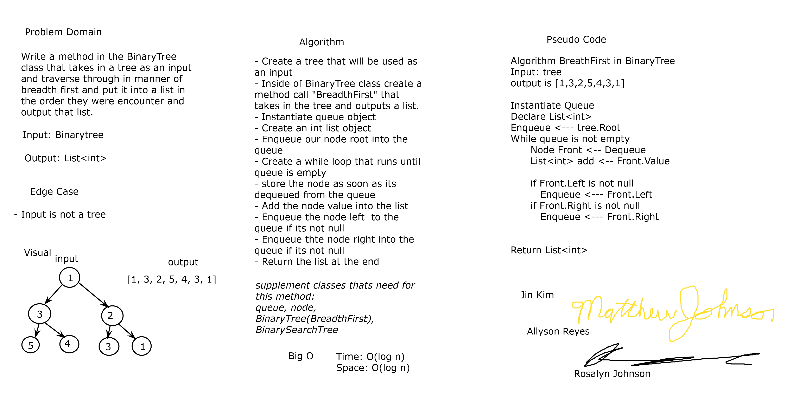
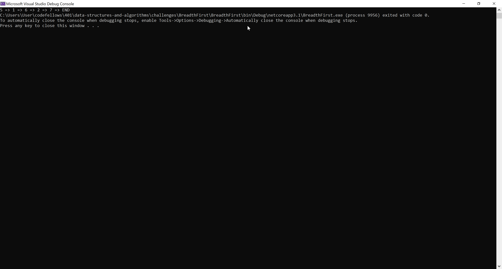
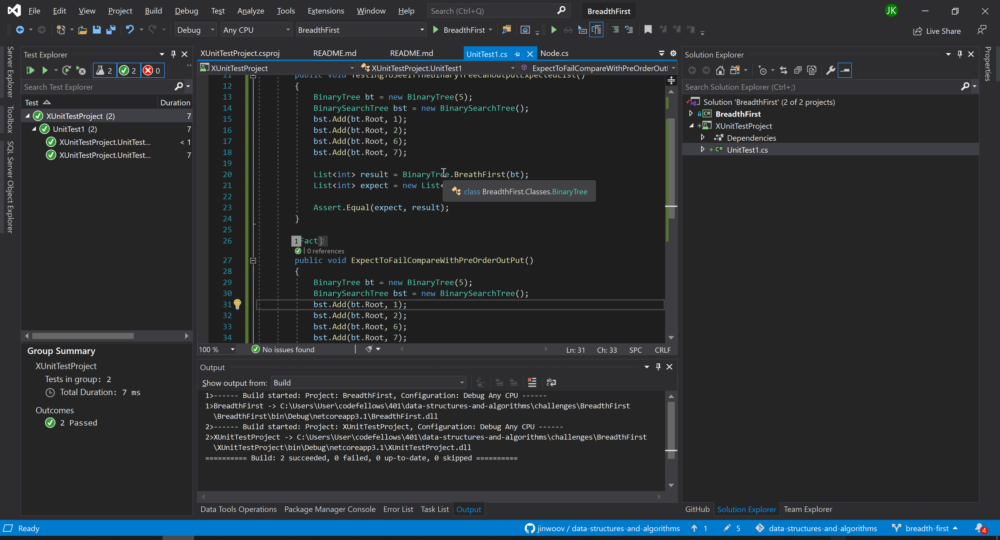

# **Breadth First**

**Author: Jin Kim**

---

### Problem Domain

Create a method that resides in the BinaryTree class. Make this method to traverse in breadth first sequence without utilizing the built-in method. Return the list of values in the tree in the order they were encountered.

---

### Inputs and Expected Outputs

#### Stack

             1
          2      3
       4    5  6    7

|Output |
| :--------- | 
| 1, 2, 3, 4, 5, 6, 7 |

---

### Big O

| Time | Space |
| :----------- | :----------- |
| O(log n) | O(log n) |

---

### Whiteboard Visual

###### *Coauthors: Matthew Johnnson, Allyson Reyes, Rosalyn Johnson** 

---

### Screen Shot
---

Screenshot of functional application

Screenshot of unit testing passed

---
### Change Log
- 1.3 - Created unit tests that passes.
- 1.2 - Created a method that will be used to traverse in breadth first sequence.
- 1.1 - Added classes, `Node`, `BinaryTree`, `BinarySearchTree` and `Queue`, to the application and finished methods.
- 1.0 - Set a folder for `BreadthFirst` challenge in the challenges folder.

