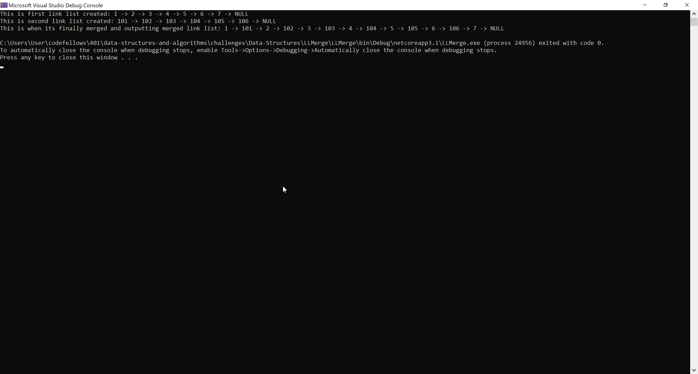

# **Linked List Merge**

**Author: Jin Kim**

---

### Problem Domain

Write a method `MergedLists` that takes two linked lists as arguments. Merged two link lists and return a reference to the head of the zipped list.

---

### Inputs and Expected Outputs

| Input(List1) | Input2(List2) |Expected Output |
| :----------- |:--------- | :----------- |
| head -> [1] -> [3] -> [2] -> X| head -> [5] -> [9] -> [4] -> X | head -> [1] -> [5] -> [3] -> [9] -> [2] -> [4] -> X |
|head -> [1] -> [3] -> X| head -> [5] -> [9] -> [4] -> X | head -> [1] -> [5] -> [3] -> [9] -> [4] -> X |
|head -> [1] -> [3] -> [2] -> X|head -> [5] -> [9] -> X | head -> [1] -> [5] -> [3] -> [9] -> [2] -> X |

---

### Big O

| Time | Space |
| :----------- | :----------- |
| O(n) | O(1) |

---

### Whiteboard Visual

---

### Screen Shot
---

Screenshot of application running

Screenshot of unit testing passed

---
### Change Log
- 1.3 - Completed README Files.  
- 1.2 - Repository error, recreated the methods and added the refactored the MergedLists method to a new class. 
- 1.1 - Created `MergedLists` and works in application.
- 1.0 - Created a repository and copied classes from Link list.

