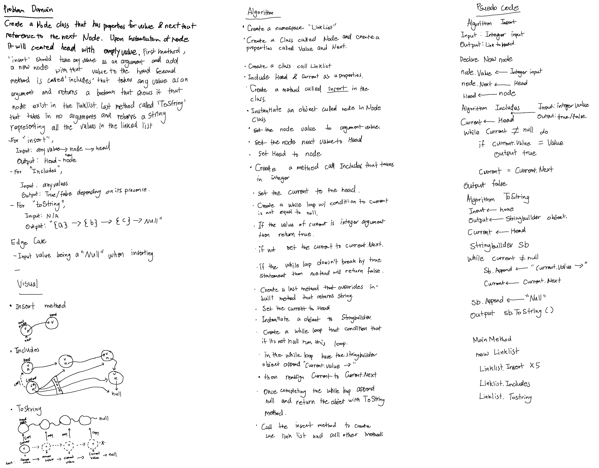
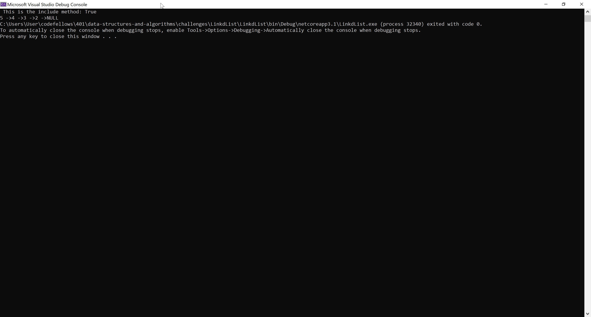
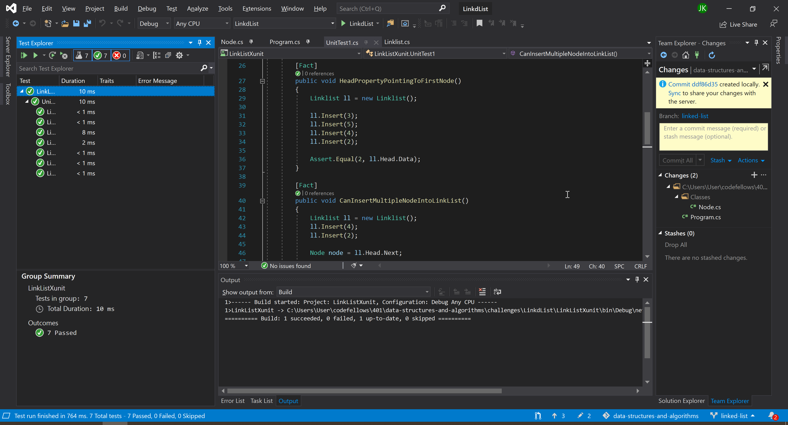

# **Linked List**

**Author: Jin Kim**

---

### Problem Domain

Create a node class that has properties for value and next that reference next node. Upon instantiating the node to the linked list, create a empty head value. Create three methods called `Insert`, `Includes` and `ToString` that will insert the node to the link list and traverse to find the node if present and print everything in the link list, methods are in respective order.

---

### Inputs and Expected Outputs

| Input | Expected Output |
| :----------- | :----------- |
| Node | Head-Node |
| Node-Node| Head-Node-Node |

---

### Big O

| Time | Space |
| :----------- | :----------- |
| O(1) | O(n) |

---

### Whiteboard Visual

---

### Screen Shot
---

Screenshot of functional application

Screenshot of unit testing passed

---
### Change Log
- 1.3 - Completed README Files.  
- 1.2 - Instantiate the linklist and able to insert,search and print all of the nodes.  
- 1.1 - Finished test driven application.  
- 1.0 - Set up a folder and created classes folder. Added linklist and node classes.  

