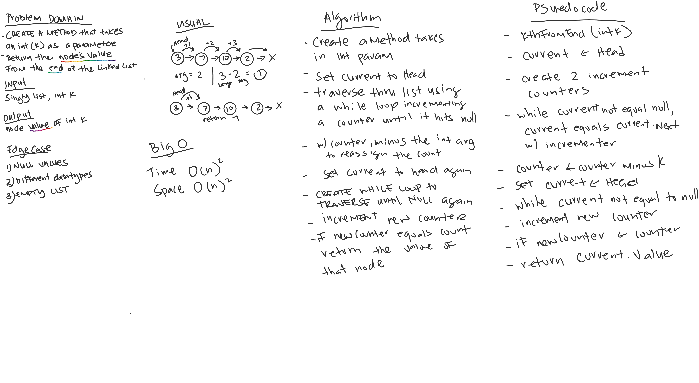
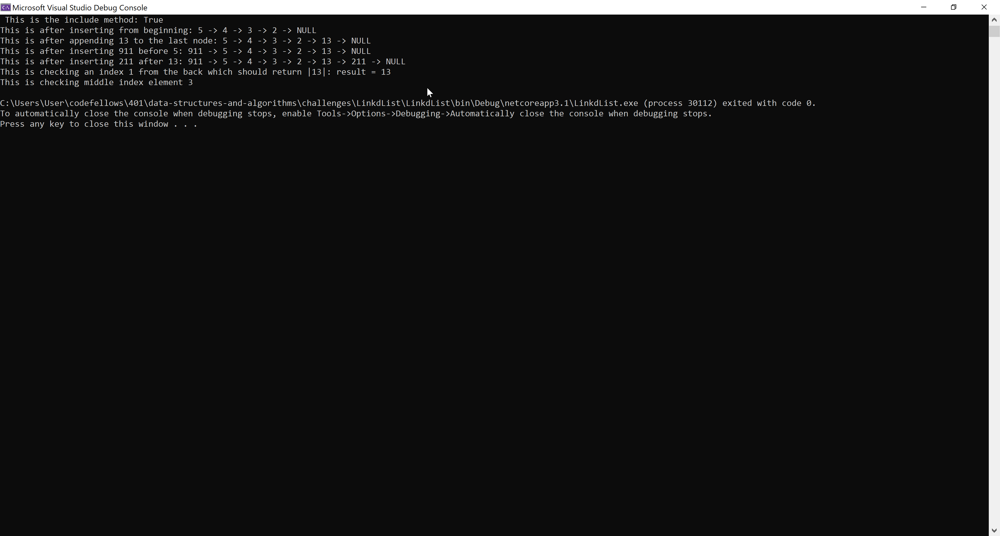
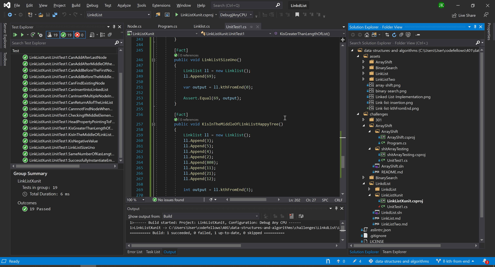

# **Linked List k-th  Value from End of Link List**

**Author: Jin Kim**  
*co-author: Allyson Reyes*

---

### Problem Domain

Create a method call `kthFromEnd` that takes k, integer input, as argument and using k to find position of node value from the end of link list.

---

### Inputs and Expected Outputs

| Input | Arg |Expected Output |
| :----------- |:--------- | :----------- |
| head -> [1] -> [3] -> [8] -> [2] -> X | 0 | 2 |
| head -> [1] -> [3] -> [8] -> [2] -> X | 2 | 3 |
| head -> [1] -> [3] -> [8] -> [2] -> X | 6 | Exception | 

---

### Big O

| Time | Space |
| :----------- | :----------- |
| O(n^2) | O(n^2) |

---

### Whiteboard Visual

---

### Screen Shot
---

Screenshot of functional application

Screenshot of unit testing passed

---
### Change Log
- 1.2 - Completed README Files.  
- 1.1 - Added unit testing for `kthFromEnd` added respective methods to pass the test.
- 1.0 - Continuing from last data structure challenge.

