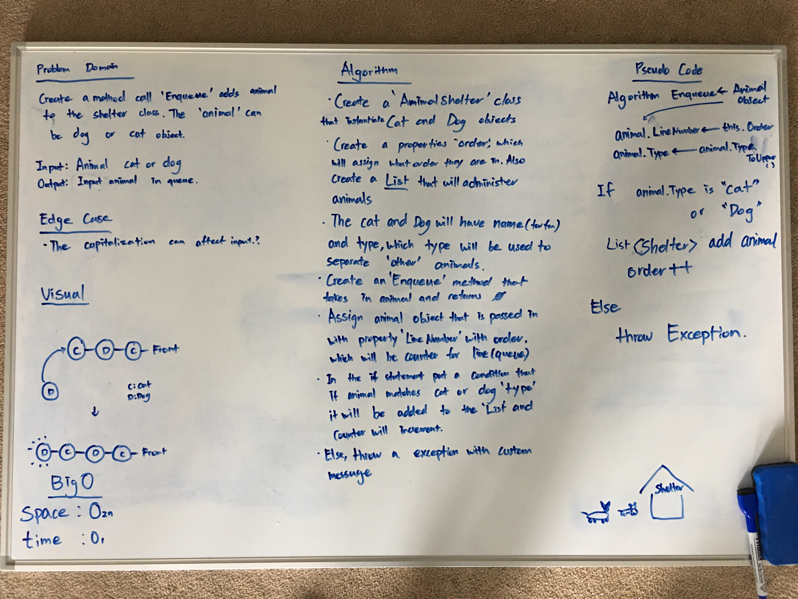
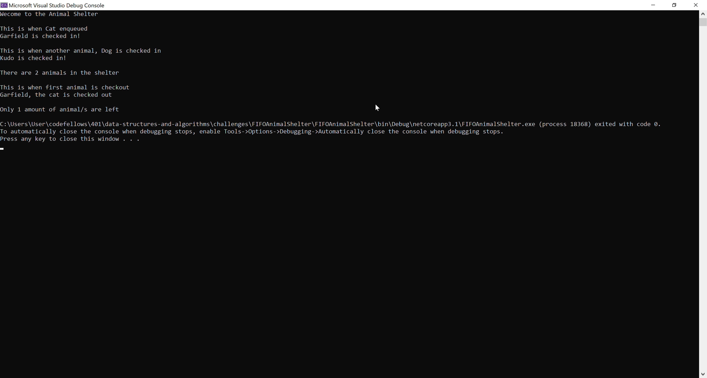
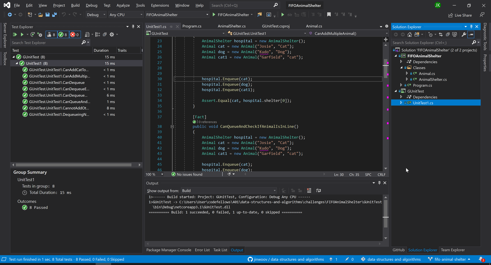

# **FIFO Animal Shelter**

**Author: Jin Kim**

---

### Problem Domain

Write a method call `Enqueue` that adds `animal` to the shelter. `animal` can be either dog or cat object. 

---

### Inputs and Expected Outputs

| Input | Arg |Expected Output |
| :----------- |:--------- | :----------- |
| []| Dog | [Dog]|

 
 
---

### Big O

| Time | Space |
| :----------- | :----------- |
| O(2n) | O(n) |

---

### Whiteboard Visual

---

### Screen Shot
---

Screenshot of functional application

Screenshot of unit testing passed

---
### Change Log
- 1.3 - Completed README Files.  
- 1.2 - Unit test passing.
- 1.1 - Added `Enqueue` method to the AnimalShelter class.
- 1.0 - Continuing from last data structure challenge.

