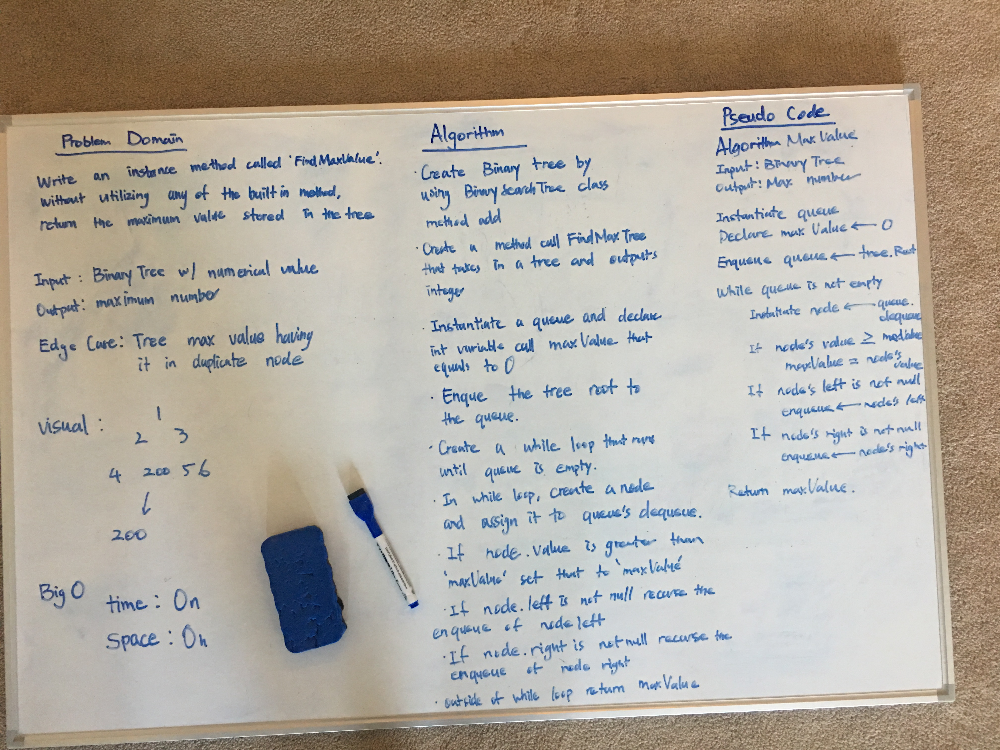
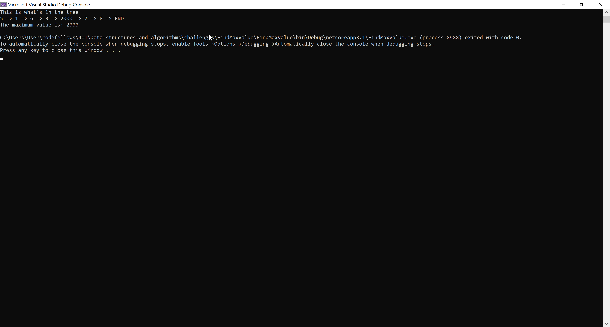
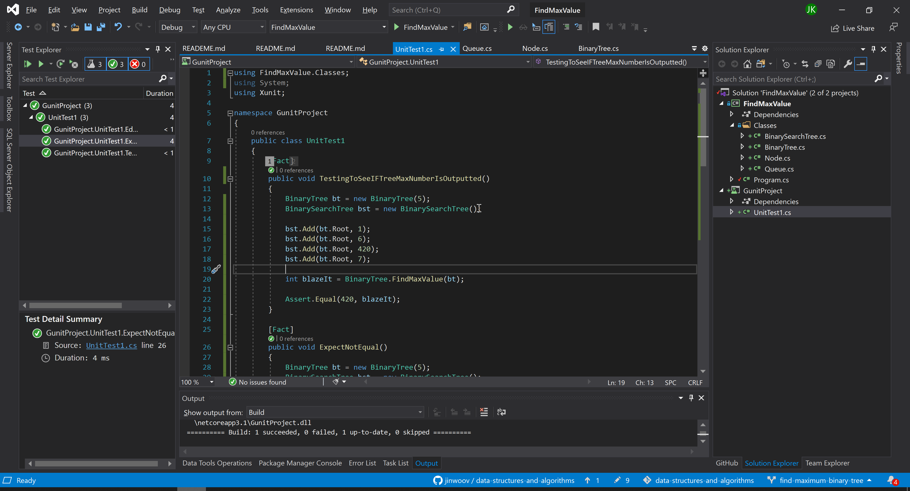

# **Find Max Value**

**Author: Jin Kim**

---

### Problem Domain

Write an instance method called find-maximum-value. Without utilizing any of the built-in methods available to your language, return the maximum value stored in the tree. You can assume that the values stored in the Binary Tree will be numeric.

---

### Inputs and Expected Outputs

#### Stack

             1
          2      3
       4    200  6    7

|Output |
| :--------- | 
| 200 |

---

### Big O

| Time | Space |
| :----------- | :----------- |
| O(n) | O(h) |

---

### Whiteboard Visual

---

### Screen Shot
---

Screenshot of functional application

Screenshot of unit testing passed

---
### Change Log
- 1.3 - Created unit tests that passes and documentation is completed.
- 1.2 - Created a method call `FindMaxValue` in the `BinaryTree` class that will take in a tree and output highest number.
- 1.1 - Added classes, `Node`, `BinaryTree`, `BinarySearchTree` and `Queue`, to the application and finished methods.
- 1.0 - Set a folder for `FindMaxValue` challenge in the challenges folder.

