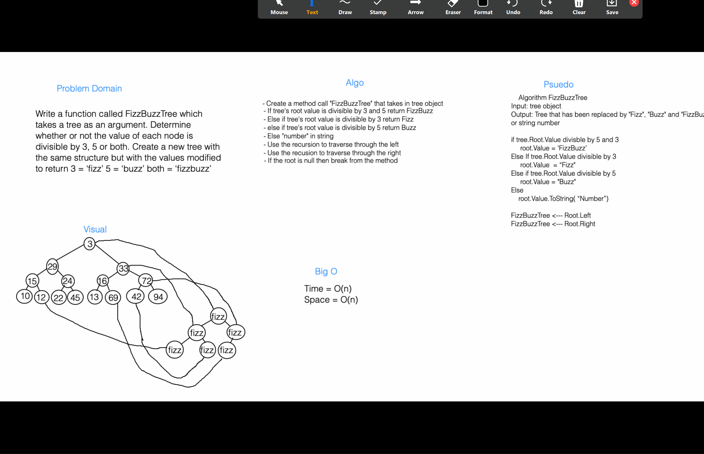
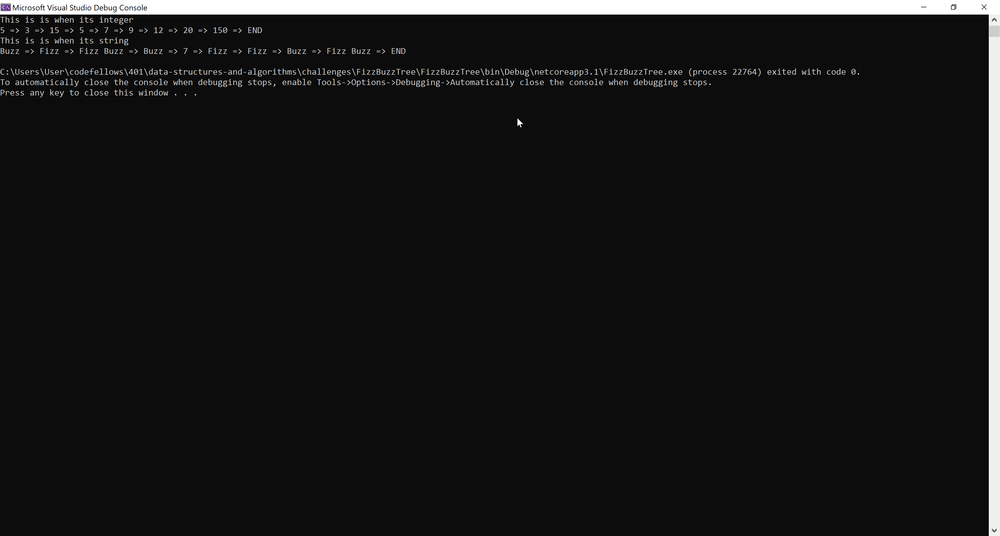

# **Fizz Buzz Tree**

**Author: Jin Kim**  
*Co-author: Carrington Beard*

---

### Problem Domain

Create method call `FizzBuzzTree` that takes in a tree as an argument and without utilizing any in built method, return `Fizz` when the node value is divisible by 3, `Buzz` when it is divisible by 5, and `FizzBuzz` when it is divisible by 3 and 5. When its neither divisble by 3 nor 5, return a string as a number. At the end, return the modify tree as an output.

---

### Inputs and Expected Outputs

---

**Input**

              1
         2        3
      4    5   6     7
    

| Output |
| :----------- |
| "1", "2" "4", Buzz, Fizz, Fizz, "7"|

---

### Big O

| Time | Space |
| :----------- | :----------- |
| O(log n) | O(n) |

---

### Whiteboard Visual

This whiteboard was completed with Carrington Beard

---

### Screen Shot
---

Screenshot of application running

Screenshot of unit testing passed

---
### Change Log
- 1.4 - Completed README Files.  
- 1.3 - Unit test is completed.
- 1.2 - Methods are working and able to print whats in the tree.
- 1.1 - Created `FizzBuzzTree` project and created two methods.
- 1.0 - Created a repository and copied classes from Link list.

