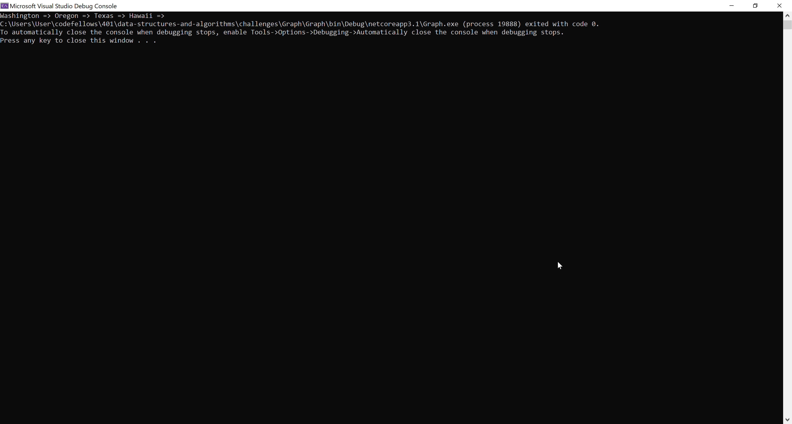

# **Graph**

**Author: Jin Kim**

*Co-author: Allyson Reyes*

---

### Problem Domain

Create a `Graph` class that implements `Addnode`,`AddEdge`, `GetNode`, `GetNeightbor`, and `Size` methods that will either add or provide whats in the graph.

---

### Inputs and Expected Outputs

Graph Undirection

| Vertex1 | Weight(distance)  |Vertex2 |
| :---|:--------- |:-----|
| "Hawaii" | 1000 | "Washington"|

Graph Direction

| Vertex1 | Weight(distance)  |Vertex2 |
| :---|:--------- |:-----|
| "Hawaii" | 1000 | "Washington"|
| "Washington" | 1000 | "Hawaii"|

---

### Big O

| Time | Space |
| :----------- | :----------- |
| O(1) | O(n) |

---

### Whiteboard Visual

---

### Screen Shot
---

Screenshot of application running

Screenshot of unit testing passed

---
### Change Log
- 1.4 - Completed README Files.  
- 1.3 - Unit testing implemented and passed.
- 1.1 - Created `Graph` class and implemented all of the methods.
- 1.0 - Created a repository.

