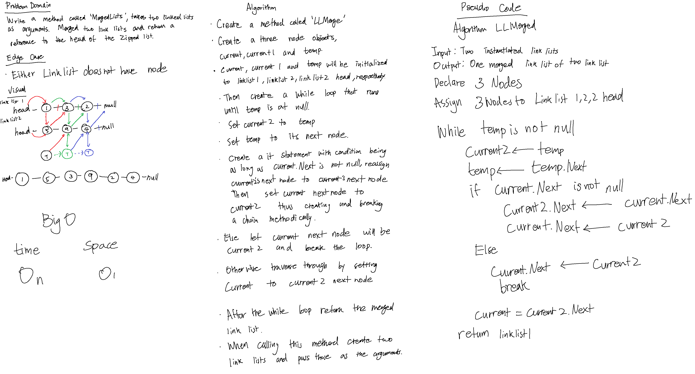
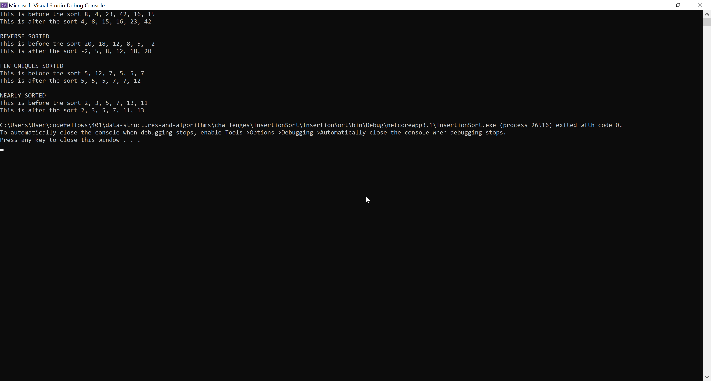

# **Insertion Sort**

**Author: Jin Kim**

---

### Problem Domain

Write a method `InsertionSort` that takes in integer array and sort it from lowest to highest and return that array.

---

### Inputs and Expected Outputs

| Input |  Expected Output |
| :----------- |:--------- |
| [8, 4, 23, 42, 16, 15] | [4, 8, 15, 16, 23, 42] | 

---

### Big O

| Time | Space |
| :----------- | :----------- |
| O(n^2) | O(1) |

---

### Whiteboard Visual

---

### Screen Shot
---

Screenshot of application running

---
### Change Log
- 1.2 - Completed README Files.   
- 1.1 - Created `InsertionSort` and works in application.
- 1.0 - Created a repository and initialized repository.

