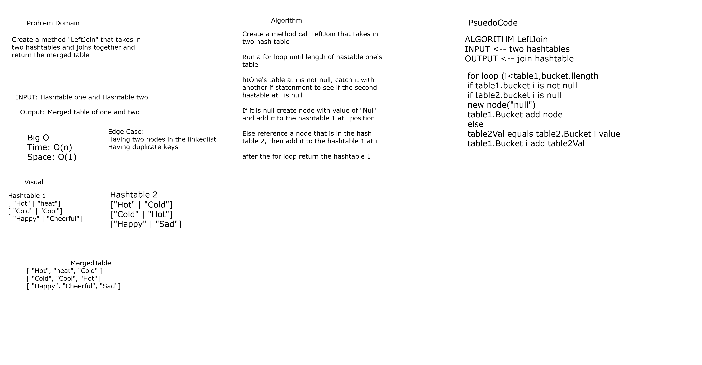
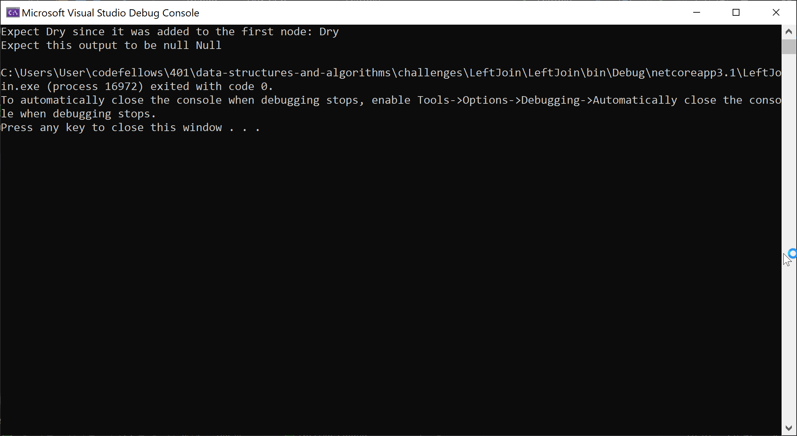
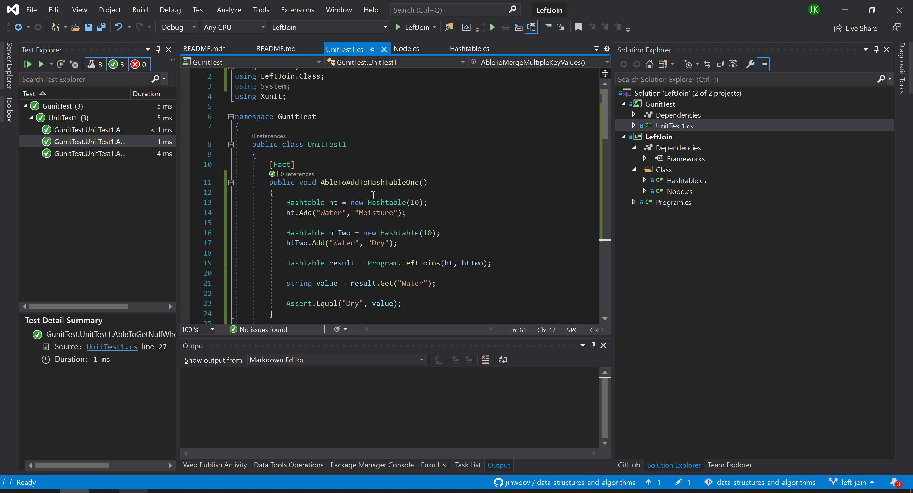

# **Left Join**

**Author: Jin Kim**

*Co-author: Allyson Reyes*

---

### Problem Domain

Create a method call `LeftJoin` that takes in two hashtables and consolidate two one hashtable using the key from hashtable one and take the values from hashtable two into the hashtable one.

---

### Inputs and Expected Outputs

Hash Table One

| Key | Value |
| :----------- |:--------- |
| New York | Jets | 

Hash Table Two  

| Key     |   Value    |
| :----------- |:--------- |
| New York | Giants | 

Output

| Key | Value       |
|:---------  |:--------- |
| New York       | Giants, Jets    |

---

### Big O

| Time | Space |
| :----------- | :----------- |
| O(n) | O(1) |

---

### Whiteboard Visual

---

### Screen Shot
---

Screenshot of application running

Screenshot of unit testing passed

---
### Change Log
- 1.4 - Completed README Files.  
- 1.3 - Unit testing implemented and passed.
- 1.1 - Created `LeftJoin` method and works in application.
- 1.0 - Created a repository.

