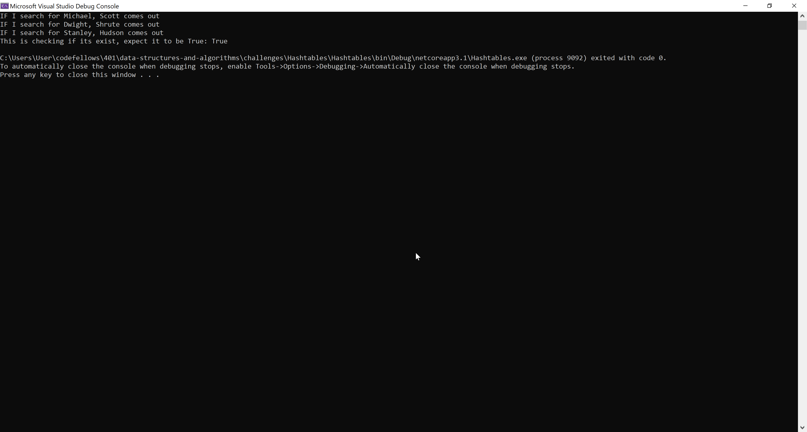
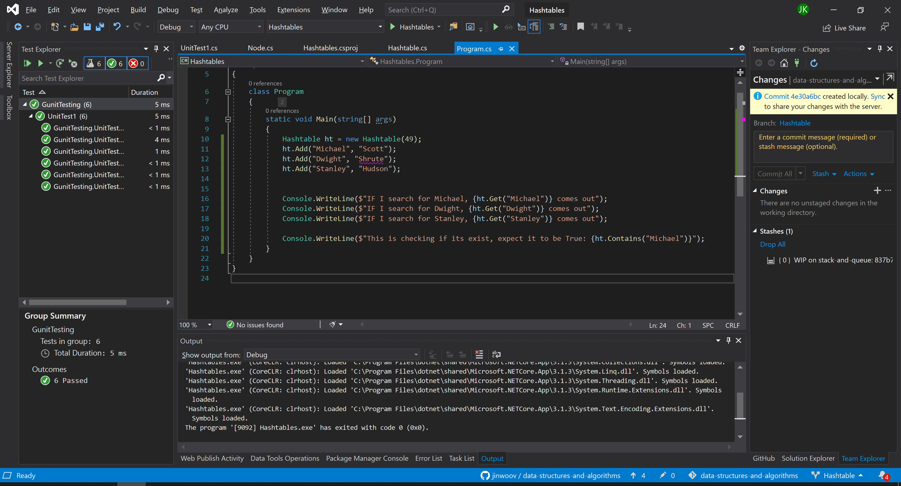

# **Hash Table**

**Author: Jin Kim**

---

### Problem Domain

Create a class `Hashtable` that has `Add`, `Contains`, `Get`, and `Hash` methods. These will be utilize to check, and add key values in the hash table.

---

### Inputs and Expected Outputs

| Key | Value |
| :----------- |:--------- |
| New York | Jets | 

| Result table|          |
|:---------  |:--------- |
| [1]         | null    |
| [2]         | null    |
| [3]         | null    |
| [4]         | null    |
| [5]         | null    |
| [6]         | null    |
| [7]         | Jets    |
| [8]         | null    |

---

### Big O

| Time | Space |
| :----------- | :----------- |
| O(n) | O(n) |

---

### Whiteboard Visual
*Not Required for this challenge*

---

### Screen Shot
---

Screenshot of application running

Screenshot of unit testing passed

---
### Change Log
- 1.4 - Completed README Files.  
- 1.3 - Unit testing implemented and passed.
- 1.1 - Created `Hashtable` class and works in application.
- 1.0 - Created a repository.

