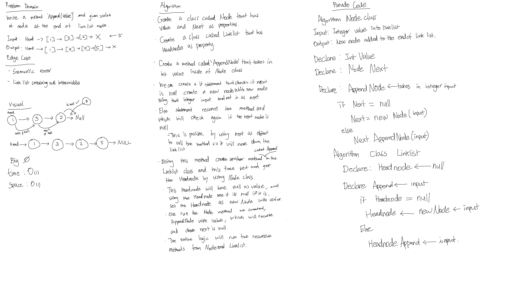
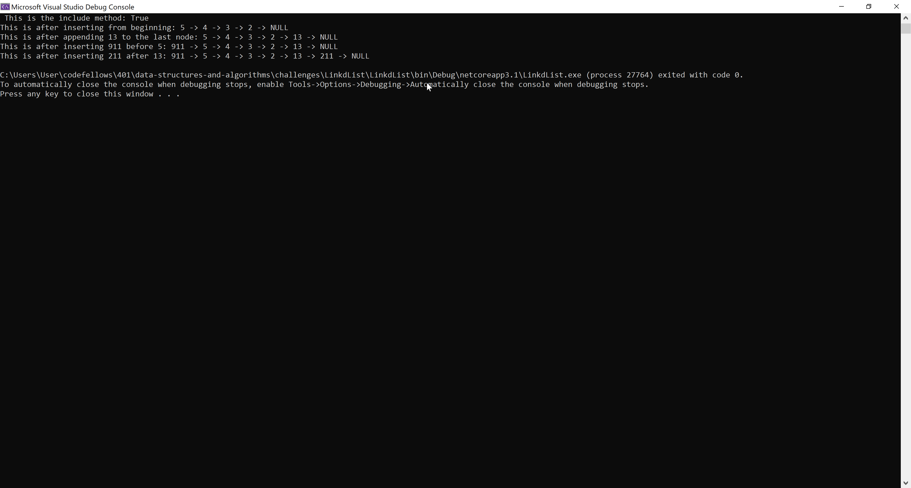
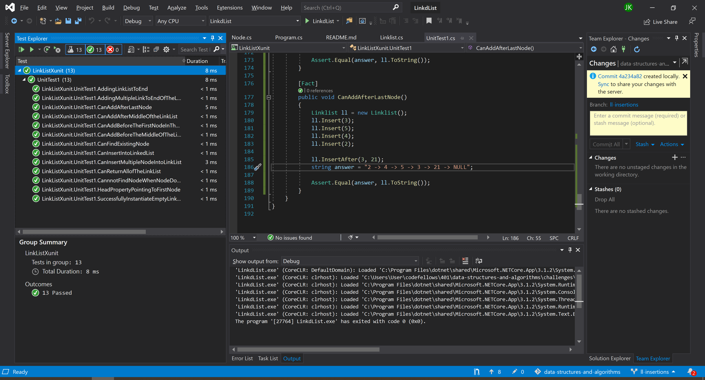

# **Linked List Insertion**

**Author: Jin Kim**

---

### Problem Domain

Write a method `Append` that takes in a integer value and assign the new Node value to integer value and append it to the last Node of the link list.

---

### Inputs and Expected Outputs

| Input | Arg |Expected Output |
| :----------- |:--------- | :----------- |
| head -> [1] -> [3] -> [2] -> X | 5 |head -> [1] -> [3] -> [2] -> [5] -> X|
| head -> X | 1  | head -> [1] -> X |

---

### Big O

| Time | Space |
| :----------- | :----------- |
| O(n) | O(n) |

---

### Whiteboard Visual

---

### Screen Shot
---

Screenshot of functional application

Screenshot of unit testing passed

---
### Change Log
- 1.3 - Completed README Files.  
- 1.2 - Added unit testing for `InsertBefore` and `InsertAfter`, and added respective methods.
- 1.1 - Added testing first and applied correct method to pass `Append` method.
- 1.0 - Continuing from last data structure challenge.

