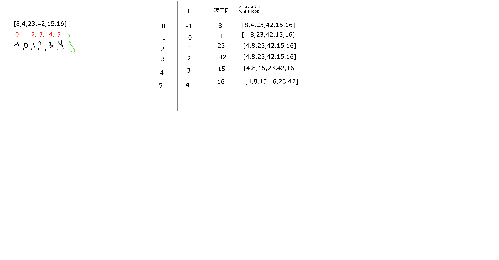

# **Merge Sort**

**Author: Jin Kim**

*Co-author: Allyson Reyes*

---

### Definition

`Merge sort` method is taking the two side of the array and sort it using `Merge` method then at the end array will be merged in sorted manner.

---

### Pseudo Code

```cs

ALGORITHM Mergesort(arr)
    DECLARE n <-- arr.length
           
    if n > 1
      DECLARE mid <-- n/2
      DECLARE left <-- arr[0...mid]
      DECLARE right <-- arr[mid...n]
      // sort the left side
      Mergesort(left)
      // sort the right side
      Mergesort(right)
      // merge the sorted left and right sides together
      Merge(left, right, arr)

ALGORITHM Merge(left, right, arr)
    DECLARE i <-- 0
    DECLARE j <-- 0
    DECLARE k <-- 0

    while i < left.length && j < right.length
        if left[i] <= right[j]
            arr[k] <-- left[i]
            i <-- i + 1
        else
            arr[k] <-- right[j]
            j <-- j + 1
            
        k <-- k + 1

    if i = left.length
       set remaining entries in arr to remaining values in right
    else
       set remaining entries in arr to remaining values in left
```

---


### Blog Article
Sample of [8,4,23,42,16,15]
 



---

### Screen Shot
---

Screenshot of application running

---

### Efficiency

- Time: O(n log n)
  - This is because there is nested while loop inside of for loop, which up the time by `O` of `n` `square`

- Space: 0(n)
  - This is because there ins't any array or list that is added to the heap and nothing has been declare or instantiated that will take the space, making the space constant of 1.


---
### Change Log
- 1.2 - Completed README Files.   
- 1.1 - Created `InsertionSort` and works in application.
- 1.0 - Created a repository and initialized repository.

