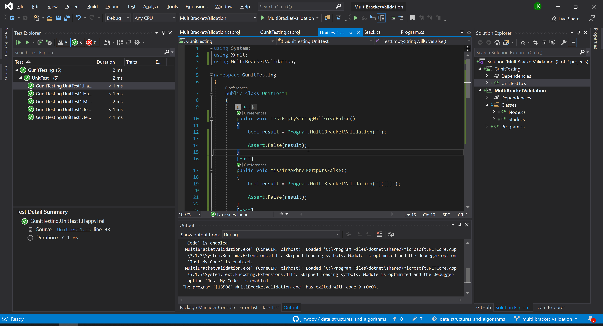

# **Multi Bracket Validation**

**Author: Jin Kim**

---

### Problem Domain

Write a method `MultiBracketValidation` that takes in a string and see if the bracket has matching bracket. If the bracket is missing a pair, return false, otherwise it all of the bracket in the string has a pair, return true.

---

### Inputs and Expected Outputs

| Input | Output |
| :----------- |:--------- |
| ()[[Extra Characters]] | True|

---

### Big O

| Time | Space |
| :----------- | :----------- |
| O(n) | O(n) |

---

### Whiteboard Visual

---

### Screen Shot
---

Screenshot of application running

Screenshot of unit testing passed

---
### Change Log
- 1.4 - Added whiteboard to the README. Documentation is completed.
- 1.3 - Completed README Files.  
- 1.2 - Created unit tests for the method and everything is passing.
- 1.1 - Created `MultiBracketValidation` and works in application.
- 1.0 - Created a repository and copied classes from Link list.

