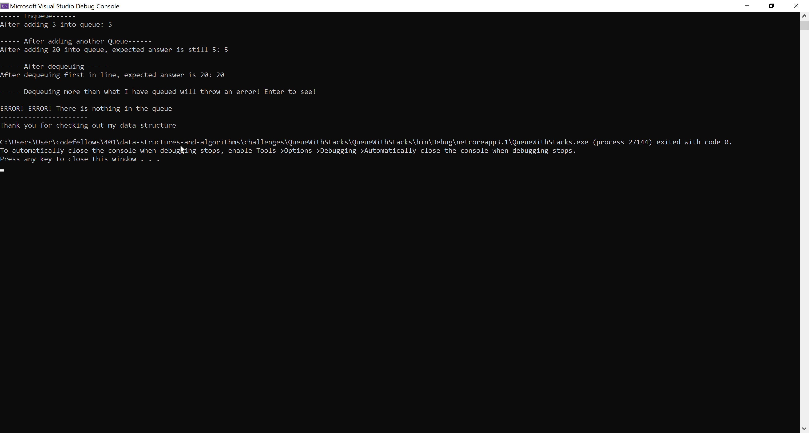
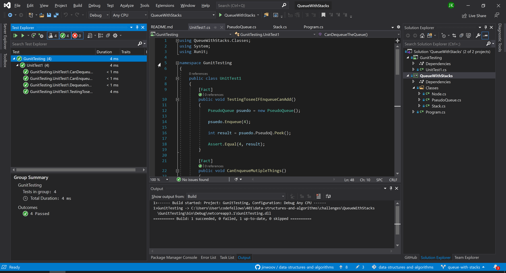

# **Queue with Stack**

**Author: Jin Kim**

---

### Problem Domain

Create a class called `PseudoQueue` that has two stack objects when instated and create a method called `Enqueue` and `Dequeue` that utilize `Push`, `Pop`, and `Peak` methods from `Stack` class.

---

### Inputs and Expected Outputs

#### Enqueue

|Input | Arg | Expected Output |
| :--------- | :----------- | :----------- |
| [10]->[15]->[20] | 5 |  [5]->[10]->[15]->[20] |
|   |5| 	[5]|

### Dequeue

|Input | Output | Internal State |
| :--------- | :----------- | :----------- |
| [5]->[10]->[15]->[20]| 20 | [5]->[10]->[15] |
| [5]->[10]->[15] |	15 | [5]->[10]|

---

### Big O

| Method | Time | Space |
| :----------- | :----------- | :----------- |
| Enqueue | O(n)| O(n) |
| Dequeue | O(1)| O(n) |

---

### Whiteboard Visual

---

### Screen Shot
---

Screenshot of functional application

Screenshot of unit testing passed

---
### Change Log
- 1.4 - README is done and table of content is updated.
- 1.3 - Unit test passing and functional.
- 1.2 - Created a `PseudoQueue` and added `Enqueue` and `Dequeue` methods.
- 1.1 - Added classes, `Stack` and `Node`, to implement it to the `PseudoQueue`.
- 1.0 - Set a folder for `QueueWithStacks` challenge in the challenges folder.

