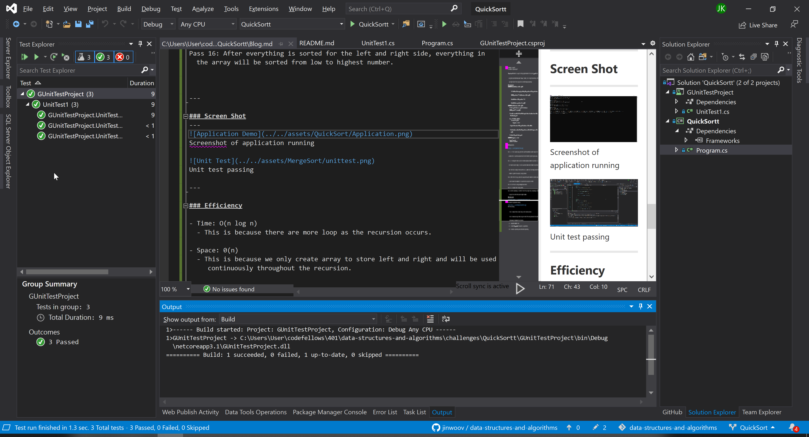

# **Quick Sort**

**Author: Jin Kim**

*Co-author: Allyson Reyes*

---

### Definition

`Quick sort` method is a way of sorting algorithm that first picks `pivot` and using that pivot determine where `low`, tracker, lies. Using the position, left and right side of the array will be sorted through separately. 

---

### Pseudo Code

```cs
ALGORITHM QuickSort(arr, left, right)
    if left < right
        // Partition the array by setting the position of the pivot value 
        DEFINE position <-- Partition(arr, left, right)
        // Sort the left
        QuickSort(arr, left, position - 1)
        // Sort the right
        QuickSort(arr, position + 1, right)

ALGORITHM Partition(arr, left, right)
    // set a pivot value as a point of reference
    DEFINE pivot <-- arr[right]
    // create a variable to track the largest index of numbers lower than the defined pivot
    DEFINE low <-- left - 1
    for i <- left to right do
        if arr[i] <= pivot
            low++
            Swap(arr, i, low)

     // place the value of the pivot location in the middle.
     // all numbers smaller than the pivot are on the left, larger on the right. 
     Swap(arr, right, low + 1)
    // return the pivot index point
     return low + 1

ALGORITHM Swap(arr, i, low)
    DEFINE temp;
    temp <-- arr[i]
    arr[i] <-- arr[low]
    arr[low] <-- temp
```

---


### Blog Article
Input `[8,4,3,42,16,15]`
 


Pass 1 ~ 2: This is when array just enters partition method in which low will be placed at the -1 position and pivot will be the farthest right of given array.  
Pass 3 ~ 7: During this time i will be iterated and when element at position i is less than the pivot integer, it will swap that element with element at position low. Since low is always at same position as i, number will not change. When the element is greater than pivot, low lags behind.   
Pass 8: After the for loop, pivot will swap position with element at position low+1 and set where the midpoint is to partial the array to be sorted.  
Pass 9-11: Left side is being exchanged and sorted.  
Pass 12 - 15: Right side is being sorted.  
Pass 16: After everything is sorted for the left and right side, everything in the array will be sorted from low to highest number.


---

### Screen Shot
---

Screenshot of application running


Unit test passing

---

### Efficiency

- Time: O(n log n)
  - This is because there are for loop that will be ran recursively as the array are being ran through `partitioning` method.

- Space: 0(log n)
  - This is because left and right side of the array are partitioned and every time partitioning method is ran, there is data that is being store logarithmatically. 


---
### Change Log
- 1.2 - Completed README Files.   
- 1.1 - Created `QuickSort` and works in application.
- 1.0 - Created a repository and initialized repository.

