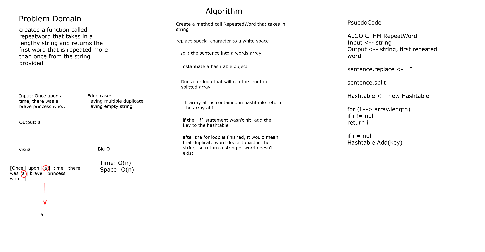
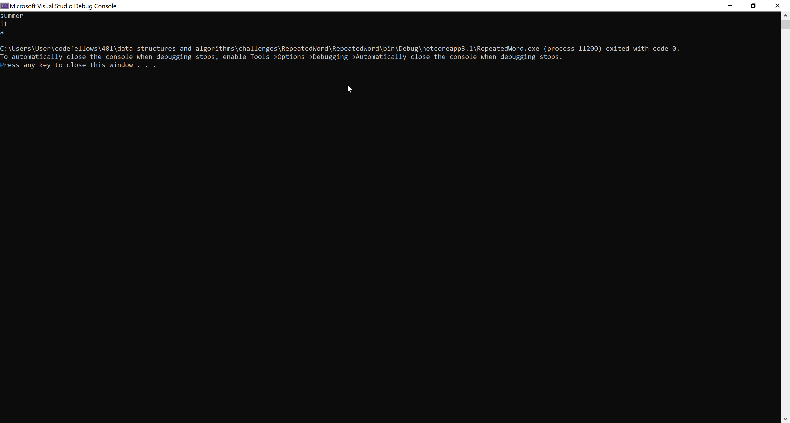
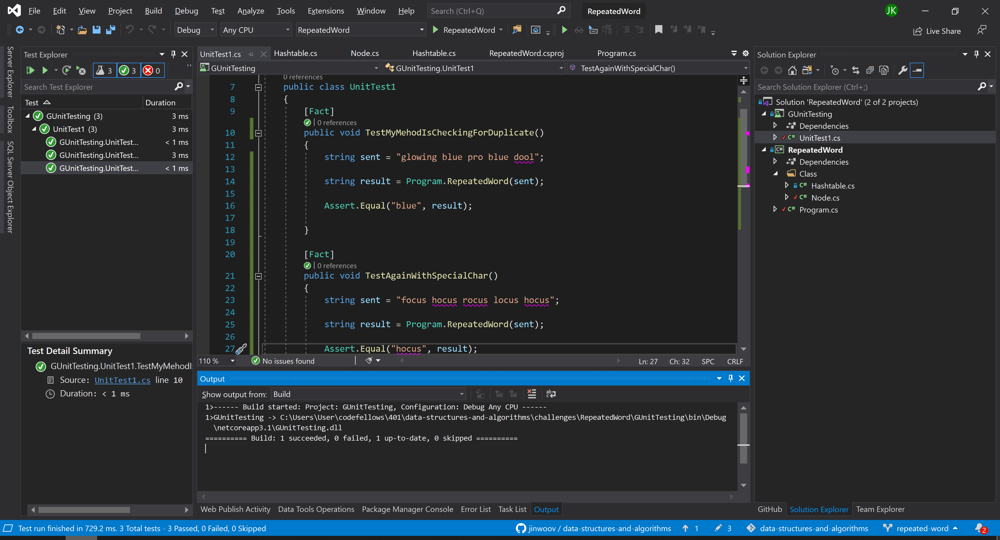

# **Repeated Word**

**Author: Jin Kim**  
*Co-Author: Allyson Reyes*

---

### Problem Domain

Create a method call `RepeatedWord` that takes in a string and returns a first duplicate word as an output.

---

### Inputs and Expected Outputs

| input | output |
| :----------- |:--------- |
| "Once upon a time, there was a brave princess who..." | "a" | 

---

### Big O

| Time | Space |
| :----------- | :----------- |
| O(n) | O(n) |

---

### Whiteboard Visual

---

### Screen Shot
---

Screenshot of application running

Screenshot of unit testing passed

---
### Change Log
- 1.4 - Completed README Files.  
- 1.3 - Unit testing implemented and passed.
- 1.1 - Created `RepeatedWord` method and works in application.
- 1.0 - Created a repository.

