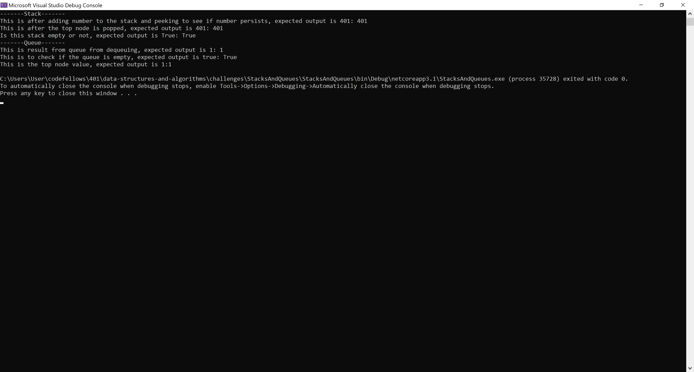
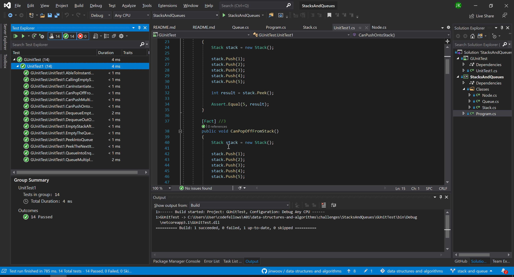

# **Stack and Queue**

**Author: Jin Kim**

---

### Problem Domain

Create a classes, `Stack` and `Queue` that will entail methods to add, take off, check if its empty or peek whats in stack and queue.

---

### Inputs and Expected Outputs

#### Stack
*Starting stack Top - 5*
|Method | Input | Expected Output |
| :--------- | :----------- | :----------- |
| Push | 4 |  Top - 4 - 5 |
| Pop | N/A | Top - 5 |
| Peek | N/A | "5" |
| IsEmpty | N/A | false |

### Queue
*Starting stack Rear - 5 - Front*
|Method | Input | Expected Output |
| :--------- | :----------- | :----------- |
| Enqueue | 4 |  Rear - 5 - 4 - Front |
| Dequeue | N/A | Rear - 5 - Front |
| Peek | N/A | "5" |
| IsEmpty | N/A | false |

---

### Big O

| Time | Space |
| :----------- | :----------- |
| O(1) | O(1) |

---

### Whiteboard Visual
**Wasn't Needed For This Challenge**

---

### Screen Shot
---

Screenshot of functional application

Screenshot of unit testing passed

---
### Change Log
- 1.2 - Created unit test that passes
- 1.1 - Added classes, `Stack` and `Queue`, to the application and finished methods.
- 1.0 - Set a folder for `Stack and Queue` challenge in the challenges folder.

