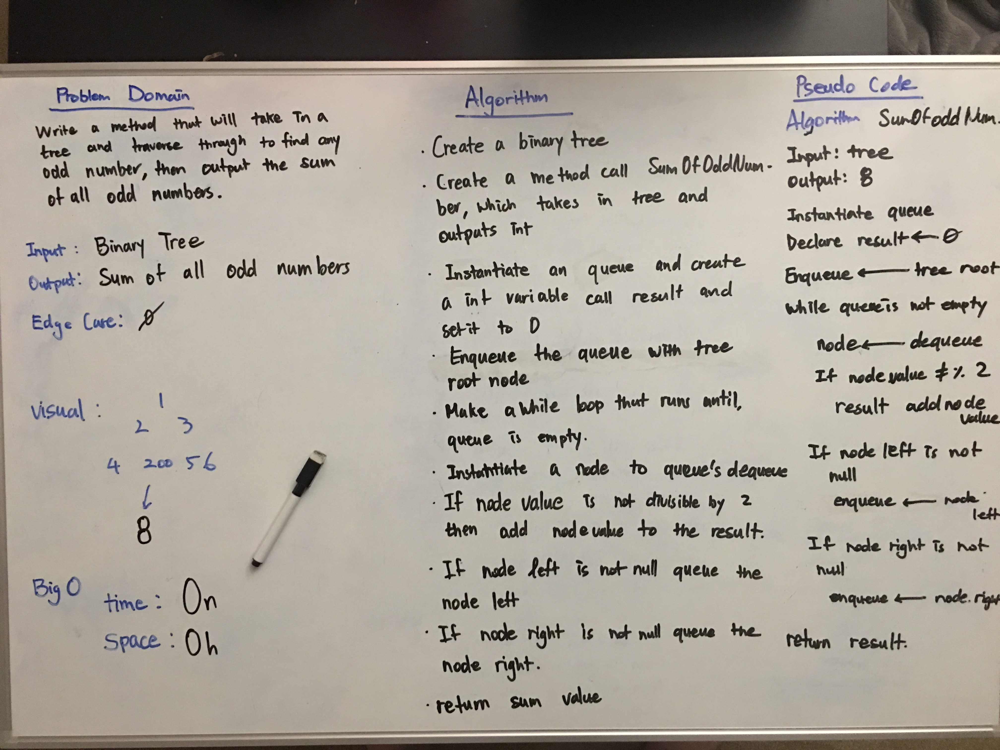
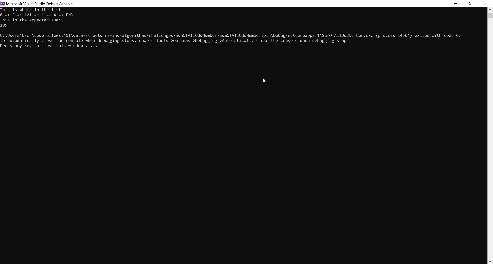

# **Sum Of All Number**

**Author: Jin Kim**

---

### Problem Domain

Write a method that will take in a tree and traverse through to find any odd number, then output the sum of all odd numbers.

---

### Inputs and Expected Outputs

#### Stack

             1
          2      3
       4    200  6    7

|Output |
| :--------- | 
| 11 |

---

### Big O

| Time | Space |
| :----------- | :----------- |
| O(n) | O(h) |

---

### Whiteboard Visual

---

### Screen Shot
---

Screenshot of functional application

Screenshot of unit testing passed

---
### Change Log
- 1.3 - Created unit tests that passes and documentation is completed.
- 1.2 - Created a method call `FindMaxValue` in the `BinaryTree` class that will take in a tree and  sum all the odd number from the tree and outputs the sum.
- 1.1 - Added classes, `Node`, `BinaryTree`, `BinarySearchTree` and `Queue`, to the application and finished methods.
- 1.0 - Set a folder for `SumOfAllOddNumber` challenge in the challenges folder.

