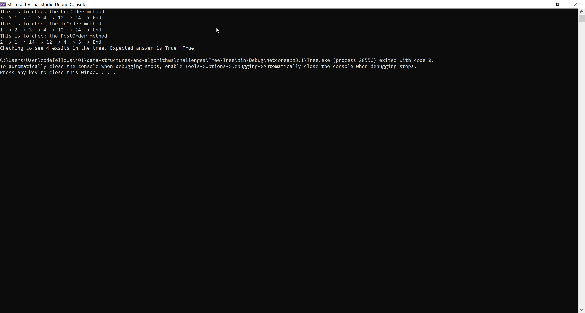

# **Binary Tree(Happy Little Trees)**

**Author: Jin Kim**

---

### Problem Domain

In the class `Tree`, create classes called `Node`, `BinaryTree`, `BinarySearchTree`. In `Node` class, include properties, `Value`, `Left` node, `right` node. In `BinaryTree`, create methods that will output array of values in the tree in order of `PreOrder`, `InOrder` and `PostOrder`. For the `BinarySearchTree`, create a method call `Add` which adds a node with desire value to left or right side of the root and a method call `Contains` which will check if the value you input exist in the tree.

---

### Inputs and Expected Outputs
              1
         2        3
      4    5   6     7
    

| Method | Output |
| :----------- |:--------- |
| PreOrder | [1, 2, 4, 5, 3, 6, 7 ]|
| InOrder | [4, 2, 5, 1, 6, 3, 7 ]|
| PostOrder | [4, 5, 2, 6, 7, 3, 1 ]|
| Add(8)| 8 will be right node of 7|
| Contain(100) | false |

---

### Big O

| Time | Space |
| :----------- | :----------- |
| O(log n) | O(n) |

---

### Whiteboard Visual

---

### Screen Shot
---

Screenshot of application running

Screenshot of unit testing passed

---
### Change Log
- 1.4 - Completed README Files.  
- 1.3 - Unit test is completed.
- 1.2 - Methods for all of the classes are done.
- 1.1 - Created `Tree` project and set all of the classes.
- 1.0 - Created a repository and copied classes from Link list.

