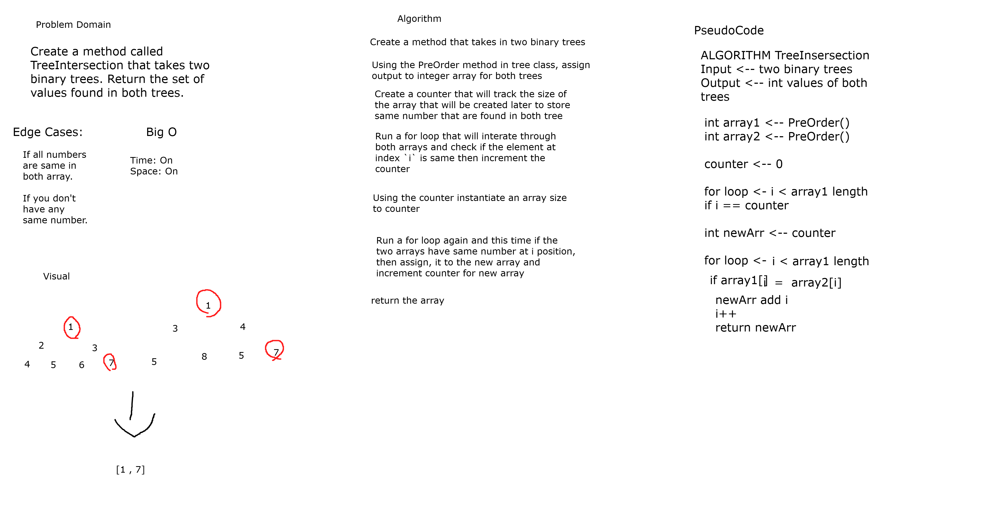
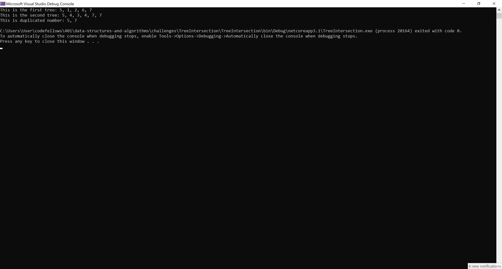
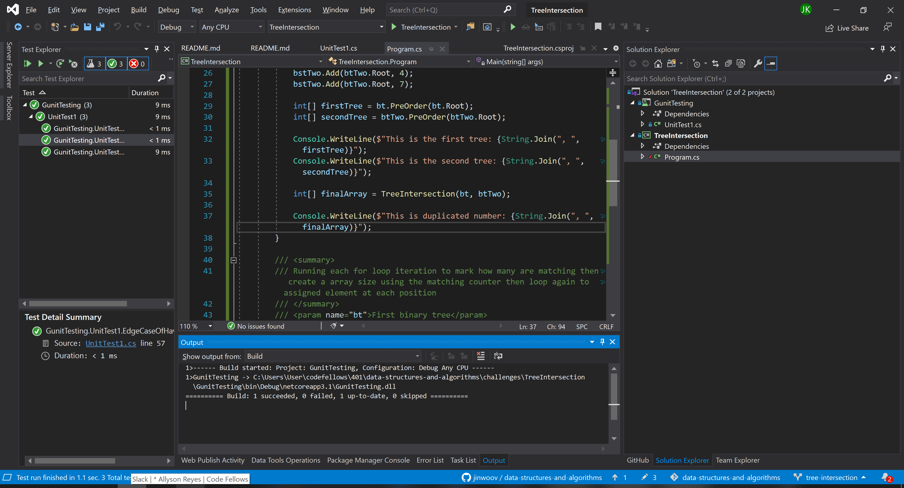

# **Tree Intersection**

**Author: Jin Kim**  
*Co-Author: Allyson Reyes*

---

### Problem Domain

Create a method call `TreeInsertion` that takes in two binary trees and returns same numbers in between two trees.

---

### Inputs and Expected Outputs

              1
         2        3
      4    5   6     7

              1
         4        5
      9    10   16     7

| Output |
|:-------|
|1, 7|

---

### Big O

| Time | Space |
| :----------- | :----------- |
| O(n) | O(n) |

---

### Whiteboard Visual

---

### Screen Shot
---

Screenshot of application running

Screenshot of unit testing passed

---
### Change Log
- 1.4 - Completed README Files.  
- 1.3 - Unit testing implemented and passed.
- 1.1 - Created `TreeIntersection` method and works in application.
- 1.0 - Created a repository.

